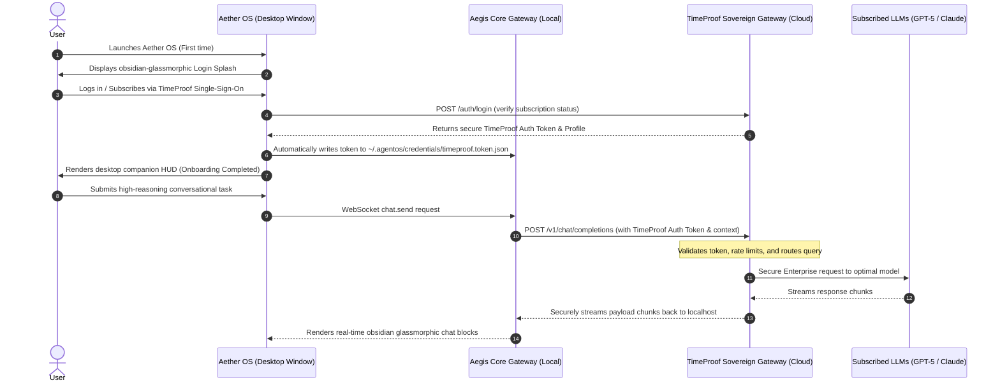

# TimeProof Labs LLC: Frictionless Subscription & Onboarding Architecture Plan

This document outlines the master architectural and product design blueprint to achieve a **100% zero-friction, premium consumer onboarding experience** for **Aether OS (Aegis Core)**. By establishing a first-party subscription and secure cloud-proxy infrastructure managed by **TimeProof Labs LLC**, we eliminate developer-centric hurdles (like creating accounts on OpenAI or Anthropic, setting up developer billing, generating API keys, and copy-pasting raw key strings into system config files).

---

## 1. Problem Statement & Strategic Moat

Currently, mainstream consumers are blocked from experiencing agentic desktop ecosystems due to multi-step credential friction:
1. **Console Navigation**: Signing up for third-party developer consoles (Google AI Studio, Anthropic Console, OpenAI Platform).
2. **Billing Friction**: Setting up separate, metered, credit-card backed billing accounts.
3. **Data Security Anxiety**: Handling, copying, and pasting raw private API keys into configuration files on their local filesystem.

### The Solution: TimeProof Unified Subscription
By launching a first-party **TimeProof Labs LLM Subscription**, users get a premium consumer app experience:
* **One-Click Start**: Sign up, log in, subscribe, and start executing agent tasks immediately.
* **Unified Billing**: A single subscription fee covering advanced high-reasoning models (GPT-5.4, Claude 3.5 Sonnet, etc.).
* **Enterprise Inference SLA**: High-throughput, low-latency, and pre-negotiated rate limits routed securely through TimeProof's enterprise infrastructure.

---

## 2. Dynamic Architecture & System Topology

Aether OS retains its local sovereign architecture (local database, secure local tools, device integration) while routing inference through the **TimeProof Sovereign Cloud Proxy** for subscribed users.



---

## 3. The Sovereign Hybrid Principle (BYOK Escape Hatch)

To protect the core philosophy of Aether OS—**Sovereignty, Customizability, and Privacy**—the architecture maintains a hybrid capability model.

> [!NOTE]
> Mainstream consumers default to the frictionless **TimeProof Subscription** model. Power-users and developers retain full freedom to bypass the subscription entirely.

### Configuration Hierarchy
Aether OS resolves its models and authentication profiles via the following fallback order, configured in [agentos.json](file:///C:/Users/midni/.agentos/agentos.json):

```
                       ┌─────────────────────────┐
                       │   Resolve Model Call    │
                       └────────────┬────────────┘
                                    │
                  Is BYOK (Bring-Your-Own-Key) enabled?
                                    ├─────────────────YES──┐
                                    NO                     │
                                    ▼                      ▼
                       ┌─────────────────────────┐   ┌────────────────────────┐
                       │  TimeProof Cloud Proxy  │   │  Local Offline Model   │
                       │ (Subscribed Inference)  │   │ (Ollama / Llama.cpp)   │
                       └─────────────────────────┘   └──────────┬─────────────┘
                                                                │
                                                        Is Local Offline ready?
                                                                ├───────────NO──┐
                                                               YES              │
                                                                ▼               ▼
                                                     ┌────────────────────────────┐
                                                     │ Direct Third-Party Cloud   │
                                                     │ (OpenAI / Anthropic / Dev) │
                                                     └────────────────────────────┘
```

---

## 4. Implementation Steps for the Onboarding Flow

### Phase A: The Obsidian-Glassmorphic Login UI
Create a beautiful, premium sign-in interface loaded by Electron during initial boot if no active profile exists:
* Native sign-in form with single-sign-on (SSO) support.
* Modern layout utilizing rich gradients, subtle floating particle micro-animations, and clean dark obsidian theme.

### Phase B: Local Credentials Storage
1. Securely cache the TimeProof auth token at:
   `~/.agentos/credentials/timeproof.token.json`
2. Automatically write the `"timeproof"` provider config to `agentos.json` as the default agent model:
   ```json
   "agents": {
     "defaults": {
       "model": "timeproof/gpt-5.4"
     }
   }
   ```

### Phase C: TimeProof Cloud Proxy Integration
Define the `timeproof` model provider mapping in the local gateway core to route inference through TimeProof's cloud endpoint:
* **Base URL**: `https://api.timeprooflabs.com/v1` or `https://aegis.timeproof.ai`
* **Secure Streaming**: Fully support OpenAI-compatible Server-Sent Events (SSE) to deliver real-time chunk streaming.

---

## 5. Security & Privacy Guardrails

> [!IMPORTANT]
> TimeProof Labs LLC operates under a strict Zero-Retention Privacy policy for subscribed enterprise endpoints.

* **Payload Redaction**: Local tools running on the user's local machine (such as command execution, browser control, and file transfers) execute **entirely locally**. Sensitive parameters or local filesystem contents are never sent to the TimeProof proxy.
* **Redact Sensitive Flag**: The gateway uses `"redactSensitive": "tools"` by default in [agentos.json](file:///C:/Users/midni/.agentos/agentos.json), ensuring that only the explicit chat prompt context is piped to the LLM endpoint.
